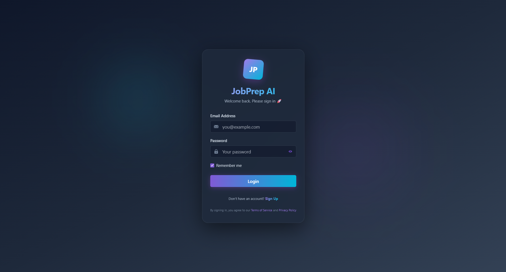
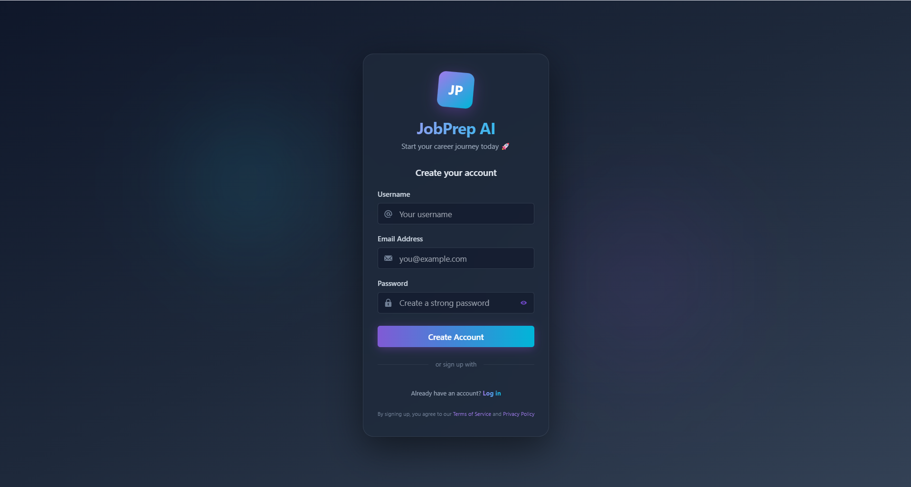
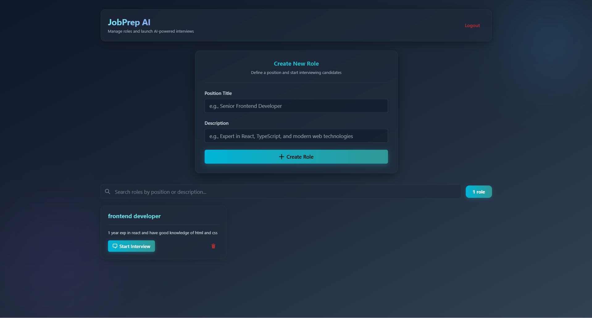
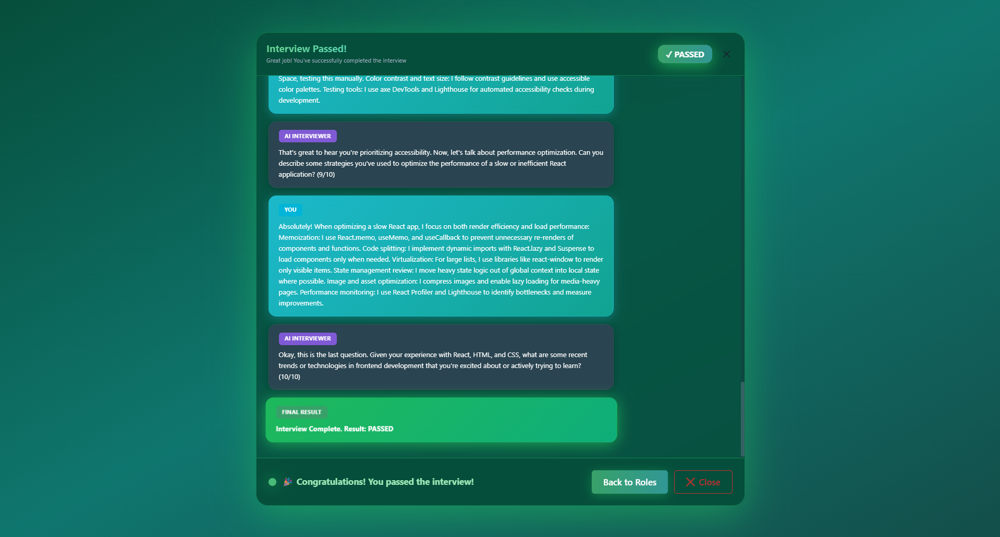
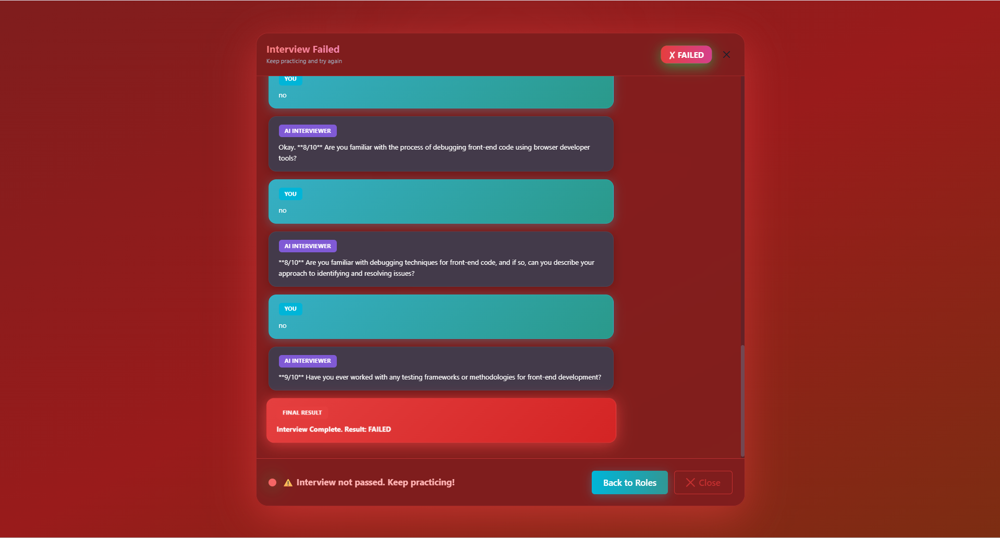

# JobPrep AI
### AI-Powered Interview Preparation Platform

> An intelligent mock interview system using Google Gemini AI, real-time WebSocket communication, and full-stack TypeScript development.

[](https://www.linkedin.com/in/jinaypatel1634/)

---

## 💼 About This Project

JobPrep AI is a full-stack web application that helps job seekers practice technical interviews with an AI interviewer. The system conducts realistic mock interviews tailored to specific job roles, maintains conversation context, and provides automated performance evaluations.

**Built to demonstrate:** Full-stack development, AI integration, real-time systems, and modern DevOps practices.

## ⚡ Key Features

- **AI-Powered Interviews** - Google Gemini 2.0 Flash with contextual memory
- **Real-Time Communication** - WebSocket-based instant messaging
- **Secure Authentication** - JWT tokens with bcrypt encryption
- **Role Management** - Custom job positions with descriptions
- **Performance Evaluation** - Automated candidate assessment
- **Responsive UI** - Modern design with Chakra UI + Tailwind CSS

## 🛠️ Technology Stack

| Layer | Technologies |
|-------|-------------|
| **Frontend** | React 19, TypeScript, Vite, Chakra UI, Tailwind CSS, Socket.IO Client |
| **Backend** | Node.js, Express.js, TypeScript, Prisma ORM, PostgreSQL, JWT, Socket.IO |
| **AI/ML** | Google Gemini AI, LangChain, LangGraph |
| **DevOps** | Docker, Docker Compose, Git |

## 📁 Project Architecture

```
JobPrep_AI/
├── backend/              # Express.js API Server
│   ├── prisma/          # Database schema & migrations
│   ├── routes/          # API endpoints
│   ├── modules/         # Auth & core logic
│   └── server.ts        # Socket.IO & Express setup
│
├── JobPrep_UI/          # React Frontend
│   ├── src/
│   │   ├── components/  # Reusable UI components
│   │   ├── pages/       # Route pages
│   │   └── context/     # State management
│   └── api/             # API service layer
│
└── docker-compose.yml   # Container orchestration
```

## 🏗️ Technical Implementation

### AI & Machine Learning
- **Google Gemini 2.0 Flash** integration for natural language processing
- **LangGraph** for stateful conversation management with memory
- Context-aware follow-up questions based on previous responses
- Automated performance evaluation system

### Backend Architecture
- **RESTful API** design with Express.js and TypeScript
- **JWT authentication** with bcrypt password hashing
- **Prisma ORM** for type-safe database operations
- **WebSocket server** (Socket.IO) for real-time bidirectional communication
- Input validation with Zod schemas
- Custom error handling and logging middleware

### Frontend Development
- **React 19** with TypeScript for type safety
- **Chakra UI** and **Tailwind CSS** for modern, responsive design
- Real-time chat interface with Socket.IO client
- Form validation with React Hook Form
- Client-side routing with React Router

### Database & DevOps
- **PostgreSQL** database with Prisma migrations
- **Docker** containerization for consistent environments
- Multi-container orchestration with Docker Compose
- Environment-based configuration management

## 📸 Screenshots

- **Login UI**



- **Sign Up UI**



- **Home UI**



- **Interview Successful UI**



- **Interview Failed UI**



## 🚀 Getting Started

### Prerequisites
- Node.js 18+
- Docker Desktop
- Google Gemini API Key

### Quick Start
```bash
# Clone repository
git clone https://github.com/yourusername/JobPrep_AI.git
cd JobPrep_AI

# Configure environment variables
# backend/.env and JobPrep_UI/.env

# Run with Docker
docker-compose up --build

# Access application
# Frontend: http://localhost:5173
# Backend API: http://localhost:5000
```


## 📊 Skills Demonstrated

**Full-Stack Development**
- End-to-end application development from database to UI
- RESTful API design and implementation
- Real-time bidirectional communication
- Type-safe development with TypeScript

**AI/ML Integration**
- Large Language Model (LLM) integration
- Stateful conversation management
- Context-aware AI systems

**Software Engineering**
- Clean code architecture and design patterns
- Database schema design and migrations
- Authentication and authorization
- Error handling and validation
- Containerization and deployment

---

## 👤 Contact

**Jinay Patel**  
Full Stack Developer | Recent Graduate

💼 [LinkedIn](https://www.linkedin.com/in/jinaypatel1634/)  
💻 [GitHub](https://github.com/Jinay1634)  

> **Open to Full Stack Developer and Software Engineer positions in Canada**

---


